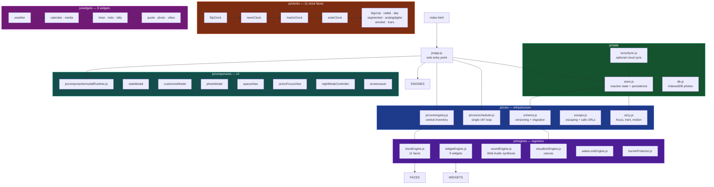

<div align="center">

# StandBy Mode Pro

**A smart clock and desk dashboard that runs entirely in your browser.**
No account. No tracking. No ads. Works offline once installed.

[](https://pavnxet.github.io/standby-mode-pro/)
[](LICENSE)
[](package.json)

</div>

---

## What it is

Turn a phone, tablet, laptop, or wall display into an ambient smart clock. Eleven
clock faces, four dashboard layouts, nine widgets, procedural ambience, and a
Pomodoro engine that keeps your focus history across devices.

It is a **plain web app**: native ES modules, no framework, no build step, and
zero runtime dependencies. It runs identically on GitHub Pages and Vercel.

---

## Features

### 11 clock faces

| Face | Description |
|---|---|
| **Retro 3D Flip** | Split-flap cards with 3D rotation physics and a synthesized mechanical tick |
| **Neon Cyberpunk** | Multi-tube neon numerals with animated glow |
| **Matrix Rain** | Phosphorescent terminal glyphs |
| **Solar Arc** | Astronomical daylight arc with solar noon and twilight |
| **Big Crop** | Oversized typographic numerals |
| **Radial Sweep** | Dual concentric gauge meters |
| **Day Friendly** | High-contrast day name, period, and large date |
| **7-Segment LED** | Bedside phosphor display |
| **Bauhaus** | Swiss-railway analog dial paired with a digital read |
| **AMOLED** | Pure black for OLED bedside displays |
| **LCARS** | Star Trek tactical console with stardates and telemetry |

Every face honours 12/24-hour format, show-seconds, and show-date.

### 4 layouts

**Standalone** (fullscreen clock) · **Duo** (2 panels) · **Quad** (2×2 grid) ·
**Focus** (dedicated Pomodoro workspace)

### 9 widgets

**Weather** (Open-Meteo, keyless) · **Calendar** · **Media Player** ·
**Timer & Stopwatch** · **TODO** · **Tally** · **Quotes** ·
**Photo Frame** (IndexedDB) · **Vibes** (ambient sound selector)

### Focus

A Pomodoro engine built around accuracy rather than ceremony:

- Background-tab-safe — timers use an absolute target time, not tick counting
- **Partial-session credit** — abandon a 50-minute session at 20 minutes and
  exactly 20 minutes is recorded, on `pagehide` or a crash
- Editable and deletable sessions with instant aggregate recalculation
- Daily, monthly, and yearly analytics
- Optional Turso-backed cross-device sync

### Display and hardware

Night mode · OLED burn-in protection · idle screensaver · fullscreen ·
Screen Wake Lock where supported.

### Privacy

**Zero analytics. Zero tracking. Zero ads.** The only permission the app requests
is geolocation, and it degrades gracefully when declined. External calls are
limited to Open-Meteo (keyless weather) and any Turso database *you* configure
yourself.

---

## Keyboard shortcuts

| Key | Action |
|---|---|
| `F` | Toggle fullscreen |
| `N` | Toggle night mode |
| `1` | Home space |
| `2` | Work space |
| `3` | Focus space |
| `4` | Night space |

Shortcuts are ignored while you are typing in a field.

---

## Getting started

The app uses native ES modules, which browsers refuse to load over `file://`. It
needs an HTTP origin.

```bash
git clone https://github.com/pavnxet/standby-mode-pro.git
cd standby-mode-pro

# Option A — the bundled zero-dependency dev server
npm run serve
# → http://localhost:8080

# Option B — anything else you like
python -m http.server 8080
```

Open `http://localhost:8080/`.

**No install step and no build step.** `js/app.js` is the entry point; every
module is loaded natively by the browser.

### Running the checks

```bash
npm test          # 43 unit + audit regression tests
npm run validate  # syntax check + tests
```

### Deploying

**GitHub Pages** — push to the default branch. Ensure Pages is set to serve the
repository root. All asset paths are relative, so the `/standby-mode-pro/`
sub-path resolves correctly.

**Vercel** — import the repository; the zero-config default is correct. The
optional `api/sync.js` proxy activates automatically if present.

---

## Architecture

Native ES modules, registered through central engines. There is no build step
and no bundler in the runtime path.



### Key design decisions

| Decision | Why |
|---|---|
| **Vanilla ES modules, no framework** | The 11-clock / 9-widget registry already works and adds zero dependencies. Glance reached 37K stars with "minimal vanilla JS". |
| **No build step** | Source is what runs. The legacy `app.bundle.js` had already drifted from source and is no longer referenced. |
| **Schema versioning in the payload** | Settings survive upgrades. This is the exact bug that made the most-voted issue in the dashboard category. |
| **Single rAF scheduler** | One animation loop for the whole app, paused when the tab is hidden. |
| **Central registry** | Adding a clock or widget is one declaration, not an edit across several files. |
| **Backend optional** | The app is fully functional with no server at all. |

---

## Project documentation

| Document | Contents |
|---|---|
| [`AUDIT.md`](AUDIT.md) | Verified code audit: architecture, defects, performance, accessibility |
| [`COMPETITOR_MATRIX.md`](COMPETITOR_MATRIX.md) | 23 researched competitors with sourced features and complaints |
| [`FEATURE_PLAN.md`](FEATURE_PLAN.md) | 56 major planned features with complexity, dependencies, and risk |
| [`TESTING.md`](TESTING.md) | Manual checklist plus recorded verification results |
| [`CHANGELOG.md`](CHANGELOG.md) | Numbered inventory of all planned features and their status |

---

## Contributing

Run `npm run validate` before opening a pull request. The CI workflow checks
JavaScript syntax, resolves every static and dynamic import, asserts the entry
point and relative asset paths, verifies registered module ids are unique,
runs the test suite, and enforces a source size budget.

---

## License

MIT. Bundled wallpaper photography in `assets/wallpapers/` is provided for
personal use.